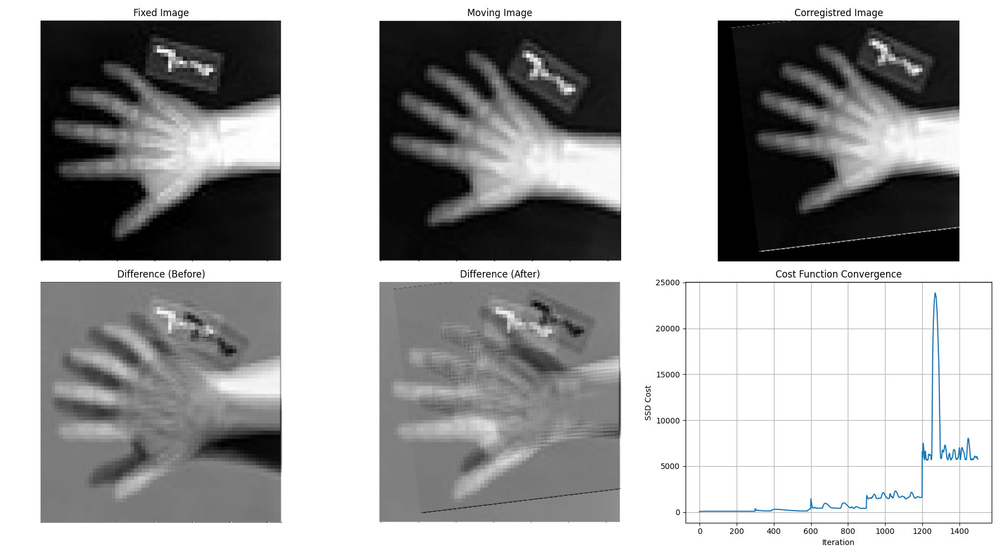

# Registro de Imagens 2D com Otimização Multi-resolução

## 📖 Sobre o Projeto

Este projeto foi desenvolvido como um estudo prático dos conceitos fundamentais de **Processamento de Imagens (PI)**. O objetivo é alinhar (ou "registrar") uma imagem 'móvel' a uma imagem 'fixa', corrigindo diferenças de escala, rotação e translação entre elas.

Para isso, o código implementa um algoritmo de otimização iterativo que busca minimizar a diferença entre as imagens. A principal técnica utilizada é uma **abordagem multi-resolução (pirâmide de imagens)**, que torna o processo de alinhamento mais robusto e eficiente, evitando mínimos locais e acelerando a convergência.

## ✨ Funcionalidades

- **Registro baseado em Intensidade**: O alinhamento é feito comparando diretamente os valores de intensidade dos pixels.
- **Transformação de Similaridade**: Otimiza 4 parâmetros: escala ($s$), rotação ($\theta$), translação em x ($t_x$) e translação em y ($t_y$).
- **Métrica de Custo SSD**: Utiliza a Soma das Diferenças ao Quadrado (Sum of Squared Differences) para medir a similaridade entre as imagens.
- **Otimizador Adam**: Emprega o otimizador Adam para encontrar os melhores parâmetros de transformação de forma eficiente.
- **Abordagem Multi-resolução**: Usa pirâmides de imagens para realizar o registro do nível mais grosseiro ao mais fino, garantindo maior precisão e robustez.
- **Visualização Completa**: Gera e exibe gráficos claros com as imagens original, móvel, registrada, e as diferenças antes e depois do processo.

## ⚙️ Como Funciona

O algoritmo segue uma estratégia de otimização refinada em múltiplos estágios:

1.  **Pré-processamento e Pirâmides de Imagens**: As imagens de entrada são normalizadas e redimensionadas. Em seguida, são criadas "pirâmides" para cada imagem, que consistem em versões progressivamente menores (menor resolução) da imagem original.

2.  **Otimização Iterativa (do Topo para a Base)**: O processo de otimização começa no nível mais alto da pirâmide (imagens de menor resolução).
    - O algoritmo busca os parâmetros de transformação que minimizam a métrica de custo SSD.
    - O resultado dessa otimização (os parâmetros encontrados) é então usado como a estimativa inicial para o próximo nível da pirâmide (resolução maior).

3.  **Refinamento Progressivo**: Ao passar de um nível de resolução baixo para um mais alto, o algoritmo refina a busca. A otimização em baixa resolução encontra uma aproximação geral, enquanto a otimização em alta resolução ajusta os detalhes finos. Isso evita que o otimizador fique "preso" em soluções incorretas (mínimos locais).

4.  **Resultado Final**: Após percorrer todos os níveis da pirâmide, os parâmetros finais são aplicados à imagem móvel original de alta resolution para gerar a imagem registrada final.

## 🧠 Fundamentos Matemáticos

Para alinhar as imagens, o algoritmo se baseia em quatro pilares matemáticos: a transformação geométrica, a interpolação, uma função de custo e um método de otimização.

### 1. Transformação de Similaridade 2D

Uma transformação de similaridade combina escala, rotação e translação. Ela é representada por uma matriz de transformação afim 3x3 que atua sobre coordenadas homogêneas $(x, y, 1)$.

**Parâmetros:**
- $s$: fator de escala.
- $\theta$: ângulo de rotação em radianos.
- $t_x, t_y$: deslocamentos (translação) nos eixos x e y.

**Matriz de Transformação Direta (M)**
Esta matriz mapeia um ponto $(x_m, y_m)$ da imagem móvel para um ponto $(x_f, y_f)$ na imagem fixa. A transformação é aplicada em torno do centro da imagem para um comportamento de rotação e escala mais intuitivo.

$$
\begin{pmatrix} x_f \\ y_f \\ 1 \end{pmatrix} = M \begin{pmatrix} x_m \\ y_m \\ 1 \end{pmatrix}
\quad \text{onde} \quad
M =
\begin{pmatrix}
s \cos(\theta) & -s \sin(\theta) & t_x \\
s \sin(\theta) & s \cos(\theta) & t_y \\
0 & 0 & 1
\end{pmatrix}
$$

**Matriz de Transformação Inversa ($M_{inv}$)**
Bibliotecas como a `scipy.ndimage.affine_transform` operam de forma inversa: para cada pixel na imagem de *saída* (fixa), elas calculam de qual coordenada na imagem de *entrada* (móvel) ele veio. Portanto, precisamos da transformação inversa.

$$
M_{inv} =
\begin{pmatrix}
\frac{1}{s} \cos(-\theta) & -\frac{1}{s} \sin(-\theta) & t'_x \\
\frac{1}{s} \sin(-\theta) & \frac{1}{s} \cos(-\theta) & t'_y \\
0 & 0 & 1
\end{pmatrix}
$$
Onde $t'_x$ e $t'_y$ são os deslocamentos transformados para o sistema de coordenadas inverso. O código calcula essa matriz e o *offset* necessário para aplicá-la corretamente.

### 2. Interpolação Bilinear

Quando aplicamos a transformação inversa, a coordenada resultante na imagem móvel $(x_m, y_m)$ raramente é um número inteiro. Ela cai "entre" os pixels. Para determinar a intensidade de cor nesse ponto, usamos a interpolação bilinear. Ela calcula uma média ponderada dos 4 pixels mais próximos, resultando em uma imagem transformada suave e com menos artefatos do que o método do vizinho mais próximo.

### 3. Função de Custo: Soma das Diferenças ao Quadrado (SSD)

Para medir o quão bem a imagem móvel está alinhada com a imagem fixa, usamos a SSD. Ela calcula a soma dos quadrados das diferenças de intensidade de cada pixel correspondente.

$$SSD(s, \theta, t_x, t_y) = \sum_{i,j} (I_{fixa}(i,j) - I_{movel\_transformada}(i,j))^2$$

O objetivo da otimização é encontrar o conjunto de parâmetros $(s, \theta, t_x, t_y)$ que **minimiza** o valor da SSD. Um valor de SSD baixo significa um bom alinhamento.

### 4. Otimização com Gradiente Descendente

O Gradiente Descendente é um algoritmo iterativo para encontrar o mínimo de uma função. Neste caso, queremos minimizar a função de custo SSD. A regra de atualização dos parâmetros é:

$$\text{parâmetros}_{\text{novos}} = \text{parâmetros}_{\text{antigos}} - \alpha \cdot \nabla SSD(\text{parâmetros}_{\text{antigos}})$$

- $\alpha$ é a **taxa de aprendizado** (learning rate), que controla o tamanho do passo em cada iteração.
- $\nabla SSD$ é o **gradiente** da função SSD, um vetor que aponta na direção de maior crescimento da função. Andamos na direção oposta para minimizar.

O código utiliza **Adam**, uma variação mais sofisticada do gradiente descendente que adapta a taxa de aprendizado para cada parâmetro individualmente, levando a uma convergência mais rápida e estável.

### 5. Cálculo do Gradiente por Diferenças Finitas

Calcular a derivada analítica da SSD em relação aos parâmetros de transformação é complexo. Em vez disso, aproximamos o gradiente numericamente usando o método das **diferenças finitas (central)**. Para um único parâmetro $p$:

$$\frac{\partial SSD}{\partial p} \approx \frac{SSD(p + h) - SSD(p - h)}{2h}$$

- $p$ é um dos parâmetros (ex: $s$, $\theta$, $t_x$ ou $t_y$).
- $h$ é um valor muito pequeno (perturbação), como `1e-5`.

Este cálculo é feito para cada um dos quatro parâmetros para construir o vetor gradiente $\nabla SSD$.

## 🚀 Como Executar

### 1. Pré-requisitos

Certifique-se de ter o Python 3 instalado. Você precisará das seguintes bibliotecas, que podem ser instaladas com o pip:

```bash
pip install numpy matplotlib scipy Pillow
```

### 2. Instruções

1.  Salve o código Python em um arquivo (ex: `registro.py`).
2.  Coloque as imagens que você deseja alinhar no mesmo diretório com os nomes `fixed_image.png` (imagem de referência) e `moving_image.png` (imagem a ser alinhada).
3.  Execute o script através do terminal:
    ```bash
    python registro.py
    ```
4.  O script irá processar as imagens, exibir uma janela com os resultados e salvar um arquivo `results.png` no diretório.


## 📊 Exemplo de Resultado

A saída visualiza todo o processo, mostrando a eficácia do alinhamento e a convergência do algoritmo.

*Para visualizar este resultado, execute o código. Uma imagem chamada `results.png` será gerada.*



- **Fixed Image**: A imagem de referência.
- **Moving Image**: A imagem desalinhada.
- **Corregistred Image**: A imagem móvel após a aplicação da transformação ótima.
- **Difference (Before/After)**: O mapa de diferença entre a imagem fixa e a móvel, antes e depois do registro. Idealmente, a diferença após o registro é próxima de zero (preto).
- **Cost Function Convergence**: O gráfico mostra a queda do valor de custo (SSD) a cada iteração, indicando que o otimizador está encontrando uma solução melhor.

## 🔧 Customização

Você pode ajustar os parâmetros da otimização diretamente na seção `if __name__ == '__main__':` do código:

- `num_pyramid_levels`: Número de níveis na pirâmide de imagens.
- `num_iterations`: Quantidade de iterações do otimizador por nível da pirâmide.
- `learning_rate`: A "taxa de aprendizado" do otimizador Adam.